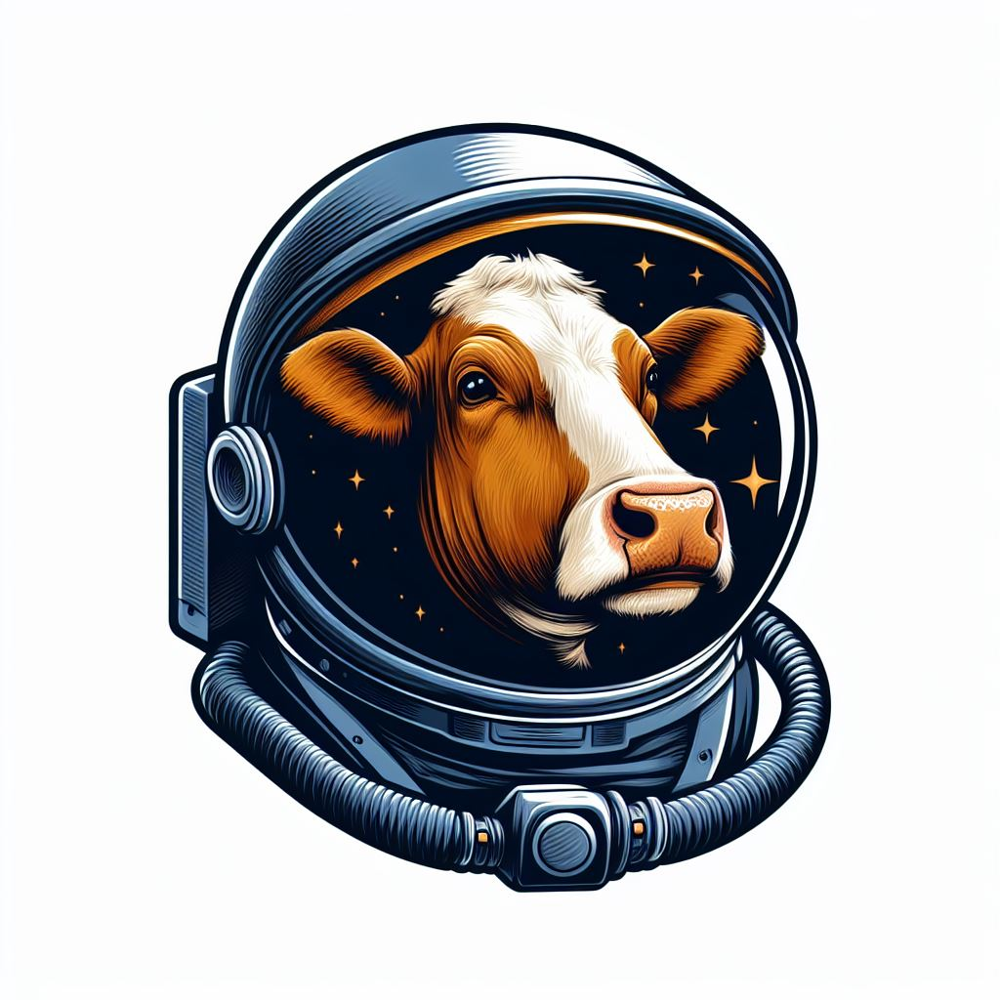
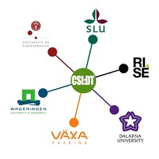
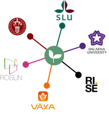

# AniSpace v0.0.2



  

The **AniSpace** R package provides a flexible and efficient framework to perform 
spatial analysis of livestock and wild animal populations. It is specifically 
designed for **high-resolution position data** and supports workflows such as:

-   Cleaning and validation of position data
-   Filtering, interpolating and refining location data
-   Deriving the precision of the positioning system
-   Deriving movement metrics (speed, step length, turning angles)
-   Estimating entity-entity and entity-environment spatial interactions
-   Estimating space use (areas, paths, home ranges)

🔗 **Official projects supporting the development of this package**:

-   [CSI:DT - Cow Social Interaction and Disease Transmission](https://www.slu.se/en/research/research-catalogue/projekt/d/precision-livestock-breeding--improving-both-health-and-production-in-dairy-cattle/)

-   [DigiGuard project](https://www.slu.se/en/research/research-catalogue/projekt/d/digiguard-project/)

  

📍 **Place**: SLU, Uppsala, Sweden

📅 **Full release data**: 1 December 2025


------------------------------------------------------------------------

## Installation

You can install the development version of `AniSpace` from GitHub using remotes:

``` r
# install.packages("remotes")
remotes::install_github("Hector-Marina/AniSpace")
```

## Learn more

If you want to learn how to use the `AniSpace` R package with real data, download and follow our example code ([examples](https://github.com/Hector-Marina/AniSpace/tree/main/vignettes)) for a step-by-step walkthrough with code and results.

------------------------------------------------------------------------

## Authors

In alphabetical order:

-   Hector Marina [](https://orcid.org/0000-0001-9226-2902) **(Maintainer)**

-   Ida Hansson [](https://orcid.org/0000-0001-7877-4135)

-   Keni Ren [](https://orcid.org/0000-0003-2817-5331)

-   Lars Rönnegård [](https://orcid.org/0000-0002-1057-5401)

Any suggestions, bug reports, forks and pull requests are appreciated. Get in touch.

------------------------------------------------------------------------

## Citation

If you use `AniSpace` in your research, please cite:

> **Marina, H., Ren, K., Hansson, I., Fikse, F., Nielsen, P.P. & Rönnegård, L. (2024).** New insight into social relationships in dairy cows and how time of birth, parity, and relatedness affect spatial interactions later in life. *Journal of Dairy Science* [<https://doi.org/10.3168/JDS.2023-23483>]<https://doi.org/10.3168/JDS.2023-23483>

> **Ren, K., Alam, M., Nielsen, P.P., Gussmann, M. & Rönnegård, L. (2022).** Interpolation Methods to Improve Data Quality of Indoor Positioning Data for Dairy Cattle. *Frontiers in Animal Science* [<https://doi.org/10.3389/FANIM.2022.896666>]<https://doi.org/10.3389/FANIM.2022.896666>

> **Hansson, I., Silvera, A., Ren, K., Woudstra, S., Skarin, A., Fikse, W.F., Nielsen, P.P. & Rönnegård, L. (2023).** Cow characteristics associated with the variation in number of contacts between dairy cows. *Journal of Dairy Science* [<https://doi.org/10.3168/JDS.2022-21915>]<https://doi.org/10.3168/JDS.2022-21915>

> **Marina, H., Nielsen, P.P., Fikse, W.F. & Rönnegård, L. (2024).** Multiple factors shape social contacts in dairy cows. *Applied Animal Behaviour Science* [<https://doi.org/10.1016/J.APPLANIM.2024.106366>]<https://doi.org/10.1016/J.APPLANIM.2024.106366>

> **Gussmann, M., Marina, H., Ren, K., Rönnegård, L. & Nielsen, P.P. (2025).** Variations in cow behaviour after regrouping in a conventional Swedish dairy herd. *Applied Animal Behaviour Science* [<https://doi.org/10.1016/J.APPLANIM.2025.106790>]<https://doi.org/10.1016/J.APPLANIM.2025.106790>

------------------------------------------------------------------------

## 📖 Versioning

The `AniSpace` package uses [semantic versioning](https://semver.org/).

------------------------------------------------------------------------

## 📜 License

The `AniSpace` package is licensed under the [GPLv3](https://github.com/stewid/SimInf/blob/main/LICENSE).
