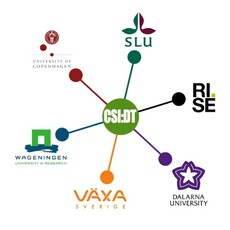
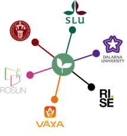

# AniSpace v1.0.0


  

The **AniSpace** R package provides a flexible and efficient framework to perform 
spatial analysis of livestock and wild animal populations. It is specifically 
designed for **high-resolution position data** and supports workflows such as:

-   Importing, structuring, and filtering spatio-temporal position data
-   Interpolating missing positions and smoothing individual movement trajectories
-   Detecting, filtering, and smoothing positional spikes based on movement speed
-   Quantifying positioning-system accuracy using stand-still reference devices
-   Deriving movement metrics including step distance, speed, and turning angle
-   Quantifying individual use of predefined environmental or facility areas
-   Classifying movement observations into movement-behaviour clusters
-   Estimating pairwise spatial interactions between individuals
-   Estimating individual utilisation distributions using grid-, polygon-, and kernel-based approaches
-   Quantifying pairwise similarity between individual utilisation distributions**
-   Calculating descriptive statistics for position data, movement, facility areas, and utilisation distributions
-   Visualising animal trajectories, spatial-interaction networks, utilisation distributions, and facility layouts
-   Fitting dyadic regression models to evaluate how individual- and pair-level characteristics are associated with spatial interactions

🔗 **Official projects supporting the development of this package**:

-   [CSI:DT - Cow Social Interaction and Disease Transmission](https://www.slu.se/en/research/research-catalogue/projekt/d/precision-livestock-breeding--improving-both-health-and-production-in-dairy-cattle/)

-   [DigiGuard project](https://www.slu.se/en/research/research-catalogue/projekt/d/digiguard-project/)

 

📍 **Developed at:** Swedish University of Agricultural Sciences (SLU), Uppsala, Sweden

📅 **Version 1.0.0 release date:** 24 August 2026

------------------------------------------------------------------------

## Installation

You can install the development version of `AniSpace` from GitHub using `remotes`:

``` r
# install.packages("remotes")
remotes::install_github("Hector-Marina/AniSpace", build_vignettes=TRUE)
```

## Tutorial

A complete tutorial covering the main `AniSpace` workflow is included as a package vignette. After installing `AniSpace` with the vignettes enabled, it can be opened directly from R using:

```r
browseVignettes("AniSpace")
```

------------------------------------------------------------------------

## Authors

In alphabetical order:

-   Hector Marina [](https://orcid.org/0000-0001-9226-2902) **(Maintainer)**

-   Ida Hansson [](https://orcid.org/0000-0001-7877-4135)

-   Keni Ren [](https://orcid.org/0000-0003-2817-5331)

-   Lars Rönnegård [](https://orcid.org/0000-0002-1057-5401)

Any suggestions, bug reports, forks and pull requests are appreciated. Get in touch.

------------------------------------------------------------------------

## Citation

If you use `AniSpace` in your research, please cite the package and the publications relevant to the methods used in your analysis:

> **Marina, H., Ren, K., Hansson, I., Fikse, F., Nielsen, P.P. & Rönnegård, L. (2024).** New insight into social relationships in dairy cows and how time of birth, parity, and relatedness affect spatial interactions later in life. *Journal of Dairy Science* [<https://doi.org/10.3168/JDS.2023-23483>]<https://doi.org/10.3168/JDS.2023-23483>

> **Ren, K., Alam, M., Nielsen, P.P., Gussmann, M. & Rönnegård, L. (2022).** Interpolation Methods to Improve Data Quality of Indoor Positioning Data for Dairy Cattle. *Frontiers in Animal Science* [<https://doi.org/10.3389/FANIM.2022.896666>]<https://doi.org/10.3389/FANIM.2022.896666>

> **Hansson, I., Silvera, A., Ren, K., Woudstra, S., Skarin, A., Fikse, W.F., Nielsen, P.P. & Rönnegård, L. (2023).** Cow characteristics associated with the variation in number of contacts between dairy cows. *Journal of Dairy Science* [<https://doi.org/10.3168/JDS.2022-21915>]<https://doi.org/10.3168/JDS.2022-21915>

> **Marina, H., Nielsen, P.P., Fikse, W.F. & Rönnegård, L. (2024).** Multiple factors shape social contacts in dairy cows. *Applied Animal Behaviour Science* [<https://doi.org/10.1016/J.APPLANIM.2024.106366>]<https://doi.org/10.1016/J.APPLANIM.2024.106366>

> **Gussmann, M., Marina, H., Ren, K., Rönnegård, L. & Nielsen, P.P. (2025).** Variations in cow behaviour after regrouping in a conventional Swedish dairy herd. *Applied Animal Behaviour Science* [<https://doi.org/10.1016/J.APPLANIM.2025.106790>]<https://doi.org/10.1016/J.APPLANIM.2025.106790>

------------------------------------------------------------------------

## 📖 Versioning

The `AniSpace` package uses [semantic versioning](https://semver.org/).

------------------------------------------------------------------------

## 📜 License

The `AniSpace` package is licensed under the [GPLv3](https://github.com/stewid/SimInf/blob/main/LICENSE).
