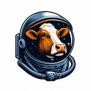

```{r setup, include=FALSE}
knitr::opts_chunk$set(
  collapse=TRUE,
  comment="#>",
  fig.width=7,
  fig.height=5
)
```


This tutorial provides an overview of how to read, process, analyse, and visualise high-resolution spatio-temporal data using the `AniSpace` R package. Throughout the tutorial, we will use data collected on a commercial dairy farm in Sweden as a practical example.

The farm is equipped with an ultra-wideband (UWB) Real-Time Location System (RTLS) that continuously records the position of the cows within the monitored area. Lactating cows are fitted with positioning tags attached to their collars. Using these high-resolution position data, we can investigate individual movement and daily behaviour, quantify how animals use different areas of the farm, and characterise spatial interactions among herd mates.



This vignette introduces the main `AniSpace` workflow:

1. [Install and load the AniSpace package](#ip)
2. [Load position, animal, and area information](#loadInfo)  
   2.1. [Position information](#pi)  
   2.2. [Animal information](#ai)  
   2.3. [Farm area information](#fi)  
   2.4. [Read position information from a file](#piF)
3. [Descriptive statistics](#ds)  
   3.1. [Position statistics](#posstats)  
   3.2. [Area statistics](#areastats)  
   3.3. [Movement statistics](#movstats)
   3.4. [Clustering movement observations](#areaclust)
4. [Estimate positioning-system accuracy](#aots)
5. [Filter data](#fd)
6. [Merge data](#md)
7. [Process animal trajectories](#pat)  
   7.1. [Smooth trajectories](#smooth)  
   7.2. [Detect and filter positional spikes](#spikes)  
   7.3. [Interpolate missing positions](#interpolate)
8. [Spatial interaction networks](#sn)
9. [Area use](#au)  
   9.1. [Time budgets](#timebudget)  
   9.2. [Entrance and exit events](#inout)
10. [Utilisation distributions and similarity](#aus)  
    10.1. [Grid-based utilisation distributions](#gridud)  
    10.2. [Polygon-based utilisation areas](#polyud)  
    10.3. [Kernel-based home ranges](#hrud)  
    10.4. [Utilisation-distribution similarity](#udsim)
11. [Dyadic interaction models](#dim)


## Install and load the AniSpace package {#ip}

Before starting the analyses, we first need to install and load the `AniSpace` package. The latest version of `AniSpace` is available from GitHub and can be installed using the `remotes` package:

```{r installation, eval=FALSE}
# install.packages("remotes")
remotes::install_github("Hector-Marina/AniSpace", build_vignettes=TRUE)
```

Once installed, we can load `AniSpace` into the R environment:

```{r load-package, message=FALSE}
library(AniSpace)
```

Throughout this tutorial, we will use the example dataset `cows`, which contains position, animal, and farm-area information collected from a commercial dairy farm in Sweden.

```{r load-data}
data(cows)
names(cows)
```

The `cows` object is a list containing three datasets:

- `positions`: high-resolution position records from the RTLS;
- `animals`: individual information associated with each cow; and
- `areas`: information describing different areas of the barn.

```{r inspect-data}
lapply(cows,dim)
```

In the following section, we will progressively combine these three sources of information into an `AniSpace` object.


## Load position, animal, and area information {#loadInfo}

The `AniSpace` object is designed to combine the different sources of information required to analyse animal movement and space use. In this example, we will progressively construct an `AniSpace` object using the three datasets included in `cows`: position records, animal information, and the spatial layout of the barn.

### Position information {#pi}

Position data were collected on a commercial dairy farm in Sweden. The farm housed approximately 210 lactating dairy cows, including Holstein, Swedish Red Dairy Cattle, and crossbred animals, in a non-insulated free-stall barn. The barn was divided into two milking groups, corresponding approximately to early- and late-lactation cows. Further information about the farm and the positioning system can be found in [Hansson et al. (2023)](https://doi.org/10.3168/JDS.2022-21915).

For this tutorial, the position dataset has been reduced to a subset of the animals to keep the package data and computation time manageable.

The position information contains:

- `Date`: date when the position was recorded.
- `Time`: time when the position was recorded.
- `ID`: identification of the positioning tag attached to the animal.
- `x`: position on the X-axis, expressed in centimetres.
- `y`: position on the Y-axis, expressed in centimetres.

We can inspect the first records with:

```{r position-data}
head(cows$positions)
```

To efficiently store and analyse high-resolution position data, `AniSpace` uses a dedicated S4 object. Position information can be loaded into this structure using `load.Space()`:

```{r load-position}
df=load.Space(cows$positions)
```


Writing the name of the object provides a summary of the information currently stored in it:

```{r show-position-object}
df
```

The information in an `AniSpace` object is organised into several slots. We can inspect their names using:

```{r slots}
names(df)
```

The main slots are:

- `NIDs`: numerical indices assigned to the individuals.
- `IDs`: original identification codes of the individuals.
- `Info`: additional individual-level information.
- `TLim`: temporal limits covered by the position records.
- `TRes`: temporal resolution of the position information.
- `Pos`: position information for each individual.
- `Area`: spatial areas available to the individuals.
- `SI`: estimated spatial-interaction information.
- `UD`: estimated utilisation distributions.
- `UDsim`: pairwise utilisation-distribution similarities.

At this stage, only the slots derived from the position information have been populated. We will progressively add the remaining information throughout the tutorial.

### Animal information {#ai}

In addition to their positions, we can incorporate individual-level information about the animals. In this example, the available cow information includes:

- `ID`: positioning-tag identification.
- `Parity`: number of the current lactation.
- `DIM`: days in milk, corresponding to the number of days since calving.
- `Pregnancy_status`: pregnancy status.
- `Breed`: breed of the cow.
- `Disease`: health-status information.

The first records can be inspected with:

```{r animal-data}
head(cows$animals)
```

Individual information is added to an existing `AniSpace` object using `load.Info()`:

```{r load-animal-info}
df=load.Info(df,InfObj=cows$animals)
```

The information is matched to the individuals already present in the object using their identification codes and stored in the `Info` slot.

The individual information stored in the object can be inspected directly:

```{r inspect-animal-info}
head(data.frame(
  NIDs=df@NIDs,
  IDs=df@IDs,
  df@Info
))
```

### Farm area information {#fi}

Spatial analyses often require information describing the physical environment in which the animals move. In our example, the barn is divided into several biologically and functionally relevant areas, including cubicles, walking alleys, feeding areas, and milking-related areas.

The area information included in `cows` describes rectangular sections of the barn using:

- `Area`: area identification.
- `x1`: minimum X-coordinate.
- `x2`: maximum X-coordinate.
- `y1`: minimum Y-coordinate.
- `y2`: maximum Y-coordinate.
- `Color`: colour used when plotting the area.

```{r area-data}
head(cows$areas)
```

Internally, `AniSpace` represents areas as polygons, allowing areas with shapes other than simple rectangles to be incorporated. Because the areas in our example are defined as rectangles, we first convert them to polygon format using `square2poly()`:

```{r square-to-poly}
AreaObj=square2poly(cows$areas)
```

The resulting polygon information can then be added to the `AniSpace` object using `load.Area()`:

```{r load-area}
df=load.Area(df,AreaObj)
```

Writing the name of the object provides a summary of the new information stored in it:

```{r show-complete-object}
df
```

We can visualise the barn layout using the standard `plot()` method for `AniSpace` objects:
```{r plot-one-individual}
plot(df)
```

Additionally, if we indicate the `NIDs` or `IDs` of one or several individuals, we can plot their positions on top of the barn layout.

```{r plot-selected-individuals}
plot(df,NIDs=c(1,3))
```

We can also restrict the plot to selected areas by specifying the corresponding area `IDs`:

```{r plot-selected-areas}
plot(df,  NIDs=c(1,3),  Area="0")
```

At this point, `df` contains all the basic information required for the analyses presented in the following sections. The basic workflow for constructing an `AniSpace` object can therefore be summarised as:

```text
Position data -> load.Space() -> load.Info() -> load.Area() -> AniSpace object
```

### Read position information from a file {#piF}

As an additional feature, the `AniSpace` package allows position data to be read directly from an external file, without requiring the information to be loaded into R beforehand. Since position records are commonly stored in external files, `AniSpace` provides the `read.Space()` function to import these data directly and convert them into an `AniSpace` object.

For example, a comma-separated file can be read using:

```{r read-position-file, eval=FALSE}
df.file=read.Space("positions.csv", type="csv")
```

The resulting object can subsequently be complemented with individual and area information in exactly the same way as before:

```{r complete-file-object, eval=FALSE}
df.file=load.Info(df.file,InfObj=cows$animals)

AreaObj=square2poly(cows$areas)
df.file=load.Area(df.file,AreaObj)

df.file
```

Therefore, the basic workflow for constructing an `AniSpace` object could alternatively be summarised as:

```text
read.Space() -> load.Info() -> load.Area() -> AniSpace object
```

## Descriptive statistics {#ds}

Before processing or analysing the animal trajectories, it is useful to explore the information contained in the `AniSpace` object and obtain an initial description of the position data, the monitored areas, and the animals' movement patterns.

`AniSpace` provides several functions for this purpose. In this section, we will use `stats.Pos()`, `stats.Area()`, and `stats.Mov()` to describe the position, area, and movement information contained in our object.

### Position statistics {#posstats}

The `stats.Pos()` function provides descriptive statistics of the position information stored in an `AniSpace` object. These summaries can be useful for identifying differences among individuals and for detecting unusual characteristics in the recorded coordinates before further processing.

```{r position-statistics}
df.pos=stats.Pos(df, graphs=FALSE, verbose=FALSE)
head(df.pos)
```


By default, the function returns a data frame containing the estimated descriptive statistics for each individual.
Graphical summaries of the position information can also be generated by setting `graphs=TRUE`. These summaries provide a first overview of the spatial distribution of the recorded positions and can help identify potential differences or irregularities among individuals.

### Area statistics {#areastats}

The characteristics of the areas incorporated into the `AniSpace` object can be summarised using `stats.Area()`.

```{r area-statistics}
df.area=stats.Area(df, graphs=FALSE,  verbose=FALSE)
head(df.area)
```

This function provides descriptive information about the spatial areas defined in the object, allowing us to inspect their dimensions and spatial characteristics before analysing how the animals use them.


### Movement statistics {#movstats}

The consecutive positions recorded for each animal can also be used to describe their movement. The `stats.Mov()` function calculates movement information between consecutive positions, including travelled distance, speed, and turning angle.

```{r movement-statistics}
df.mov=stats.Mov(df, verbose=FALSE)
head(df.mov$movement)
```

The units of the estimated movement variables depend on the spatial and temporal units of the original position data. In our example, coordinates are expressed in centimetres and time is recorded in seconds.


### Clustering movement observations {#areaclust}

In addition to calculating movement variables, `stats.Mov()` can classify observations into different movement patterns using k-means clustering. For example, we can separate the recorded movements into two clusters:

```{r movement-clustering}
set.seed(123)

df.mov2=stats.Mov(df, k.means=TRUE, k.mov=2,verbose=FALSE)

head(df.mov2$movement)
head(df.mov2$cluster)
```

Here, `k.mov=2` specifies that the movement observations should be separated into two clusters. Increasing the number of clusters allows more complex movement patterns to be identified.


## Estimate positioning-system accuracy {#aots}

Before analysing animal movement and space use, it is important to understand the accuracy of the positioning system used to collect the data. Positional error can influence estimates of movement, area use, spatial interactions, and other variables derived from the recorded coordinates.

One approach for evaluating positioning accuracy is to place one or more positioning tags at fixed, known locations. Because these tags remain stationary, the variation in their recorded coordinates represents the positional error of the system rather than actual movement.

`AniSpace` provides the `stats.Still()` function to characterise this variation and estimate the spatial accuracy of stationary positioning devices. The approach implemented in this function follows the methodology described by [Hansson et al. (2023)](https://doi.org/10.3168/JDS.2022-21915) to evaluate the precision of the RTLS used in this study. The `cows` dataset includes data from 10 stand-still tags that were used by Hansson et al. to assess the positioning accuracy of the system.

```{r positioning-accuracy}
df.still=stats.Still(df,NIDs=c(8:17), percentile=0.99, verbose=TRUE)
```
The `percentile` argument defines the proportion of recorded positions considered when estimating the positional accuracy. In this example, `percentile=0.99` estimates the spatial extent containing 99% of the recorded positions for each stationary device.

To reproduce the results reported by Hansson et al. (2023), we can calculate the average of the `mean_error` estimated across all stand-still tags. This provides an overall estimate of the mean positional error of the RTLS:

```{r positioning-accuracy-mean}
mean(df.still$mean_error)
```

Different percentiles can also be evaluated simultaneously. This can be useful for understanding how the estimated positional error changes when increasingly extreme observations are included:

```{r positioning-accuracy-percentiles}
df.still=stats.Still(df, NIDs=c(8:17), percentile=c(0.50,0.95,0.99), verbose=TRUE)
```

Graphical summaries can also be generated by setting `graphs=TRUE`:

```{r positioning-accuracy-graphs}
df.still.graph=stats.Still(df, NIDs=c(8:17), percentile=c(0.50,0.95,0.99), graphs=TRUE, verbose=FALSE)
```

These results provide an empirical estimate of the positioning error under the conditions in which the reference tags remained stationary during the evaluated period.


## Filtering data {#fd}

High-resolution positioning datasets can contain information from many individuals, long monitoring periods, and several spatial areas. In many analyses, only a subset of this information may be required. Reducing the data to the individuals, time period, or areas of interest can also considerably decrease computation time in subsequent analyses.

`AniSpace` provides the `filterAniSpace()` function to subset an existing `AniSpace` object while preserving its internal structure. Data can be filtered according to the individuals, the monitored time period, and the areas included in the object.

### Filtering individuals

Individuals can be selected using either their numerical index (`NIDs`) or their original identification (`IDs`).

For example, we can retain only individuals housed in group 1 [`NIDs=c(1,2)`]:

```{r filter-individuals}
df.ID=filterAniSpace(df, NIDs=1:2, verbose=FALSE)
df.ID
```

Alternatively, individuals can be selected using their original identification codes:

```{r filter-individuals-IDs}
df.ID2=filterAniSpace(df, IDs=c("Cow3_G2","Cow4_G2","Cow5_G2","Cow6_G2","Cow7_G2"), verbose=FALSE)
df.ID2
```


### Filtering the monitoring period

Position information can also be restricted to a particular period using the `TimeWindow` argument. 
The temporal limits of the data stored in an `AniSpace` object can be inspected using:

```{r inspect-time-limits}
df@TLim
```

For example, we can retain only the first hour of the monitoring period:

```{r filter-time}
df.time=filterAniSpace(df, TimeWindow=c(df@TLim[1], df@TLim[1]+3600), verbose=FALSE)
df.time
```

In this example, `3600` corresponds to one hour expressed in seconds. The resulting `AniSpace` object contains only the position records falling within the specified time interval.

### Filtering areas

The spatial areas stored in an `AniSpace` object can also be filtered. For example, we can retain only the feeding tables of the barn layout:

```{r filter-areas}
df.Area=filterAniSpace(df, Area=c("1","2"), verbose=TRUE)
```
Note that some individuals were removed because all their positions were outside the selected areas. These areas can be visualised alongside the position information.

```{r plot-filtered-areas}
plot(df.Area,NIDs=1)
```


## Merging data {#md}

Position data may be distributed across multiple files or collected during different monitoring periods. After loading and processing these datasets separately, it may be useful to combine them into a single `AniSpace` object.

`AniSpace` extends the standard R `merge()` function to allow two compatible `AniSpace` objects to be combined while preserving their internal structure.

To illustrate this functionality, we will merge the two datasets created in the filtering section `df.ID` and `df.ID2`. The resulting `AniSpace` object will contain the combined position information from both objects.

```{r merge-objects}
df.merge=merge(df.ID, df.ID2, verbose=FALSE)
df.merge
```

When two `AniSpace` objects are merged, previously calculated derived information, such as spatial interactions or utilisation-distribution similarities, should be recalculated because the underlying position information has changed.


## Process animal trajectories {#pat}

High-resolution positioning systems may generate trajectories containing short-term fluctuations, positional spikes, or missing observations. These characteristics can affect the results of further analyses based on positional data.

`AniSpace` includes several functions for processing individual trajectories before subsequent analyses. In this section, we will illustrate three common operations: smoothing trajectories, detecting and removing positional spikes, and interpolating missing positions.

### Smoothing trajectories {#smooth}

Small fluctuations in the recorded coordinates may occur even when an individual moves very little or remains stationary. Depending on the positioning system and the objective of the analysis, smoothing the trajectories can help reduce these short-term fluctuations.

The `smooth()` function applies a running median independently to the X- and Y-coordinates of each individual. The size of the smoothing window is controlled using the `smooth.wind` argument.

For example, we can smooth the trajectories using a window of five consecutive positions:

```{r smooth-trajectories}
df.smooth=smooth(df, smooth.wind=5, verbose=FALSE)
df.smooth
```

The function returns a new `AniSpace` object in which the original coordinates have been replaced by the smoothed coordinates.

We can compare the original and smoothed coordinates for the first individual:

```{r compare-smoothed-trajectories}
head(data.frame(
  x=df@Pos[[1]]$x,
  x.smooth=df.smooth@Pos[[1]]$x,
  y=df@Pos[[1]]$y,
  y.smooth=df.smooth@Pos[[1]]$y
))
```

The value selected for `smooth.wind` should depend on the temporal resolution of the positioning system and the biological process under study. Large smoothing windows may remove meaningful short-term movements, whereas very small windows will have a limited effect on the trajectory.

### Detecting and filtering positional spikes {#spikes}

Occasionally, positioning systems can generate isolated coordinates located far from the surrounding trajectory. These positional spikes can result in unrealistically large estimated movement speeds and may strongly influence subsequent analyses.

The `spikes()` function identifies these observations based on the speed between consecutive positions.

If a maximum biologically plausible speed is known, it can be provided directly using the `max.speed` argument. Alternatively, `AniSpace` can estimate a threshold from the observed speed distribution using the `perc.speed` argument.

For example, we can identify unusually high speeds using the 99th percentile of the observed speed distribution and remove the corresponding positions:

```{r filter-spikes}
df.spikes=spikes(df, method="filter", perc.speed=0.99,verbose=TRUE)
```

We can compare the total number of positions before and after filtering:

```{r compare-filtered-positions}
c(
  original=sum(vapply(df@Pos,function(p) length(p$Time),numeric(1))),
  filtered=sum(vapply(df.spikes@Pos,function(p) length(p$Time),numeric(1)))
)
```

Instead of removing the identified positions, the affected parts of the trajectory can also be smoothed by selecting `method="smooth"`:

```{r smooth-spikes}
df.spikes.smooth=spikes(df, method="smooth", smooth.wind=5, perc.speed=0.99, verbose=FALSE)
```

The choice between filtering and smoothing depends on the characteristics of the positioning system and the intended analysis. Removing clearly erroneous positions may be preferable when the observations are considered invalid, whereas smoothing can be useful when maintaining a continuous trajectory is important.

### Interpolating missing positions {#interpolate}

Missing observations are common in high-resolution positioning data. They may occur because of temporary signal loss, communication failures, or other technical limitations of the positioning system. Missing positions can be particularly important when analyses require simultaneous observations among individuals, such as spatial interaction analysis and area utilisation. 

`AniSpace` provides the `interpolate()` function to reconstruct missing positions at a specified temporal resolution.

Several interpolation approaches are available. In this example, we use modified Akima interpolation by specifying `method="makima"`, following [Ren et al. (2022)](https://doi.org/10.3389/FANIM.2022.896666):

```{r interpolate-positions}
df.inter=interpolate(df.merge, method="makima", TRes=1, verbose=FALSE)
df.inter
```

Here, `TRes=1` specifies that the resulting trajectory should have a temporal resolution of one second. The same argument can also be used to reduce the temporal resolution of the data; for example, setting `TRes=2` generates a trajectory with one position every two seconds.

Interpolation should be applied carefully, particularly when long periods of information are missing. Reconstructing short gaps between consecutive observations may provide a reasonable approximation of the animal's trajectory, whereas interpolation across long gaps can introduce positions that do not accurately represent the individual's true movement. 
To reduce this risk, the `TCap` argument can be used to define the maximum time gap between two known positions for which interpolation is allowed. Gaps larger than the specified `TCap` value will therefore not be interpolated.


## Spatial interaction networks {#sn}

In group-living species, spatial interactions can provide information on social structure, contact patterns, and the opportunities for direct or indirect transmission of pathogens among individuals.

`AniSpace` provides the `spatialInt()` function to estimate pairwise spatial interactions directly from the position information stored in an `AniSpace` object. Interactions are defined according to the spatial and temporal proximity between two individuals:

```{r spatial-interactions}
df.SI=spatialInt(df.merge, method="all", verbose=FALSE)
df.SI
```

The function returns the original `AniSpace` object with the estimated spatial-interaction information stored in the `SI` slot.

The estimated interaction matrix can be inspected directly using:

```{r inspect-spatial-interactions}
df.SI@SI$M
```

Each row and column represents an individual, while the values in the matrix describe the estimated interaction between each pair of animals. The diagonal represents the interaction of an individual with itself and is therefore not used when evaluating dyadic interactions.

The `method` argument determines how the interactions are quantified. Three alternatives are available:

- `method="time"` quantifies the interaction according to the time that two individuals spend interacting.
- `method="nint"` quantifies the interaction according to the number of identified interaction events.
- `method="all"` estimates and stores the interaction information required for both approaches.

The definition of an interaction depends on the spatial and temporal thresholds specified in `spatialInt()`. The distance threshold determines the maximum distance between two individuals for their simultaneous positions to be considered part of an interaction, whereas the temporal threshold defines the conditions used to distinguish independent interaction events. See [Marina et al. (2024)](https://doi.org/10.3168/JDS.2023-23483) for more information on the threshold selected.

### Visualising the interaction matrix

The resulting spatial interactions can be visualised using `plotSI()`. The interaction matrix can first be represented as a heat-map-like adjacency matrix:

```{r plot-spatial-interaction-matrix}
plotSI(df.SI, type="matrix", verbose=FALSE)
```

This representation provides an overview of the relative interaction strength among all pairs of individuals and can help identify animals or dyads with particularly high or low levels of spatial interaction.

### Visualising the interaction network

The same information can also be represented as a network, where individuals are represented by nodes and their spatial interactions by edges:

```{r plot-spatial-interaction-network}
plotSI(df.SI, type="network",group=df.merge@Info$Disease,verbose=FALSE)
```

Network representations are particularly useful for visualising the overall interaction structure of the group and identifying highly connected individuals or groups.


## Area use {#au}

Position data can also be used to quantify how animals use specific areas of their environment. In livestock systems, this may include feeding areas, resting areas, walking alleys, milking areas, or other functionally relevant locations. Similar approaches can be applied to any environment in which spatial areas of interest can be defined.

`AniSpace` provides the `areaUse()` function to quantify individual use of the areas stored in the `Area` slot of an `AniSpace` object. Two complementary approaches are available:

- `method="TimeBudget"` quantifies the number of recorded positions located within each area.
- `method="InOut"` identifies individual occupation periods based on entrance and exit events within each area.


### Time budgets {#timebudget}

The `TimeBudget` method provides a simple description of how the recorded positions of each individual are distributed across the available areas.

For example, we can estimate the time budget of all individuals across all areas using:

```{r area-time-budget}
df.TB=areaUse(df.merge, method="TimeBudget", verbose=FALSE)
head(df.TB)
```

The resulting data frame contains one row for each individual-area combination and includes:

- `NIDs`: numerical identification of the individual.
- `IDs`: original identification of the individual.
- `Area`: identification of the evaluated area.
- `occupation`: number of recorded positions located within the area.
- `npositions`: total number of recorded positions available for that individual.
- `expected_pos`: expected number of positions according to the duration and temporal resolution of the dataset.

The proportion of the recorded positions spent within each area can therefore be calculated as:

```{r area-time-budget-proportion}
df.TB$pct_occupation=100*df.TB$occupation/df.TB$npositions
head(df.TB)
```

If only specific areas are of interest, they can be selected using the `Area` argument. For example, we can estimate the time budget for the first five areas:

```{r selected-area-time-budget}
df.TB.selected=areaUse(df.merge, Area=c("1","2"), method="TimeBudget", verbose=FALSE)
head(df.TB.selected)
```

This approach provides an intuitive way to compare how individuals allocate their time among different functional areas of the environment.

### Entrance and exit events {#inout}

In some applications, knowing the total amount of time spent within an area is not sufficient. It may also be relevant to determine **when** an individual entered an area, **when** it left, and how long each occupation period lasted.

The `InOut` method identifies individual occupation periods from the sequence of recorded positions. The `t.lim` argument defines the minimum duration required for a period to be considered an occupation event. This allows short visits below the selected duration to be excluded, focusing the analysis on biologically meaningful periods of area use.

```{r area-inout}
df.IO=areaUse(df.merge, Area=1:2, method="InOut", t.lim=100, verbose=FALSE)
head(df.IO)
```

The resulting data frame includes:

- `NIDs`: numerical identification of the individual.
- `IDs`: original identification of the individual.
- `NArea`: numerical identification of the area.
- `Area`: original identification of the area.
- `time_in`: estimated entrance time.
- `time_out`: estimated exit time.
- `occupation`: proportion of positions classified as being inside the area during the identified occupation period.
- `duration`: duration of each identified occupation period.

Short deviations outside an area can also occur because of positioning error or because an animal is located close to the boundary of an area. The `t.err` argument controls the temporal tolerance used to combine occupation periods separated by short interruptions. By default, `t.err` corresponds to 5% of `t.lim`.

## Utilisation distributions and similarity {#aus}

Individuals' spatial patterns are commonly represented using utilisation distributions (UDs), which provide information on the spatial use of the available area.

`AniSpace` provides the `areaUD()` function to estimate individual spatial utilisation using three alternative approaches:

- `method="grid"` estimates a grid-based utilisation distribution.
- `method="poly"` estimates the spatial area used by an individual using a polygon surrounding its recorded positions.
- `method="HR"` estimates a kernel-based home range.

The resulting information is stored directly in the `UD` slot of the `AniSpace` object and can subsequently be summarised with `stats.UD()`, visualised with `plotUD()`, or compared among individuals using `UDsim()`.

### Grid-based utilisation distributions {#gridud}

The grid-based approach divides the monitored environment into cells of a predefined spatial resolution and counts the number of positions recorded within each cell. This provides a direct representation of how intensively different parts of the available space are used:

```{r grid-utilisation}
df.UD=areaUD(df.merge, method="grid", res=c(100,100), verbose=FALSE)
df.UD
```

Here, `res=c(100,100)` defines the dimensions of the grid cells along the X- and Y-axes. Since the coordinates in our example are expressed in centimetres, each cell corresponds to an area of 1 $m^2$.

The estimated utilisation distribution for an individual can be visualised using `plotUD()`:

```{r plot-grid-utilisation}
plotUD(df.UD, NIDs=1)
```

Descriptive statistics of the estimated utilisation distributions can be obtained using `stats.UD()`:

```{r stats-grid-utilisation}
df.UD.stats=stats.UD(df.UD, verbose=FALSE)
head(df.UD.stats)
```

### Polygon-based utilisation areas {#polyud}

A second approach is to describe the total spatial extent used by each individual using a polygon surrounding its recorded locations. This can be estimated by setting `method="poly"`:

```{r polygon-utilisation}
df.poly=areaUD(df.merge, method="poly", res=c(100,100), verbose=FALSE)
df.poly
```

For each individual, `AniSpace` constructs a convex polygon containing the recorded positions. Unlike the grid-based approach, this method focuses primarily on the spatial extent used by the individual rather than on differences in the intensity of use within that area.

The resulting polygon can be visualised using:

```{r plot-polygon-utilisation}
plotUD(df.poly, NIDs=1, plot.Pos = TRUE)
```

Several individuals can also be displayed simultaneously:

```{r plot-multiple-polygons}
plotUD(df.poly, NIDs=c(1,2,3))
```

This makes it possible to visually compare the spatial extent used by different individuals.

Descriptive statistics can again be obtained using `stats.UD()`:

```{r stats-polygon-utilisation}
df.poly.stats=stats.UD(df.poly, verbose=FALSE)
head(df.poly.stats)
```


### Kernel-based home ranges {#hrud}

Kernel utilisation distributions provide a continuous probabilistic representation of an individual's space use. Instead of assigning positions directly to grid cells or defining a single polygon around all recorded locations, kernel methods estimate a spatial probability distribution based on the density of observed positions:

```{r kernel-utilisation}
df.HR=areaUD(df.merge, method="HR", res=c(100,100), verbose=FALSE)
df.HR
```

Different probability contours can be used to represent different portions of the estimated utilisation distribution. For example, a 95% home-range contour can be visualised as a black line surrounding the estimated utilisation distribution using:

```{r plot-kernel-utilisation}
plotUD(df.HR, NIDs=3, HR.level=95)
```

A smaller contour, such as 50%, can be used to visualise areas of more concentrated space use:

```{r plot-kernel-core}
plotUD(df.HR, NIDs=3, HR.level=50)
```

Descriptive statistics for several home-range contours can be calculated simultaneously using `stats.UD()`:

```{r stats-kernel-utilisation}
df.HR.stats=stats.UD(df.HR, HR.levels=c(50,75,95), verbose=FALSE)
head(df.HR.stats)
```

The selection of the home-range contour depends on the biological question. Larger contours describe the broader spatial extent used by the individual, whereas smaller contours can be used to characterise areas of more intensive use.

### Utilisation-distribution similarity {#udsim}

Once individual utilisation distributions have been estimated, it may also be useful to quantify how similar the spatial-use patterns of different individuals are.

`AniSpace` provides the `UDsim()` function to calculate pairwise similarities between the utilisation distributions stored in an `AniSpace` object.

For example, pairwise similarity between the grid-based utilisation distributions estimated above can be calculated using:

```{r grid-utilisation-similarity}
df.UD.sim=UDsim(df.UD,verbose=FALSE)
df.UD.sim
```

The resulting similarity information is stored in the `UDsim` slot of the `AniSpace` object. The pairwise similarity matrix can be inspected directly using:

```{r inspect-utilisation-similarity}
df.UD.sim@UDsim$M[1:7,1:7]
```

Each row and column represents an individual, and each cell contains the estimated similarity between the utilisation distributions of a pair of individuals.

The same procedure can be applied to polygon-based utilisation areas:

```{r polygon-utilisation-similarity}
df.poly.sim=UDsim(df.poly,verbose=FALSE)
df.poly.sim@UDsim$M[1:7,1:7]
```

and to kernel-based home ranges:

```{r kernel-utilisation-similarity}
df.HR.sim=UDsim(df.HR, verbose=FALSE)
df.HR.sim@UDsim$M[1:7,1:7]
```

Note that for kernel-based utilisation distributions, the similarity can additionally depend on the home-range contour selected for comparison.

## Dyadic interaction models {#dim}

The spatial-interaction networks estimated in previous sections describe how strongly pairs of individuals interact, but they do not directly identify the factors associated with these interactions. For example, we may be interested in determining whether individuals with similar characteristics interact more frequently or whether individuals with similar patterns of space use are more likely to interact.

`AniSpace` provides the `fitERGM()` function to evaluate associations between pairwise spatial interactions and individual- or dyad-level characteristics. The function constructs a dataset containing one observation for each pair of individuals and fits a regression model to the corresponding interaction values.

Before fitting the model, the `AniSpace` object must contain both spatial-interaction information and pairwise utilisation-distribution similarities. Therefore, the required workflow is:

```text
AniSpace object -> spatialInt() -> areaUD() -> UDsim() -> fitERGM()
```

In the previous sections, we estimated these components separately. They can also be generated sequentially within the same `AniSpace` object:

```{r prepare-dyadic-model}
df.merge=spatialInt(df.merge, method="all",  verbose=FALSE)
df.merge=areaUD(    df.merge, method="grid", verbose=FALSE)
df.merge=UDsim(     df.merge,                verbose=FALSE)
df.merge
```

At this stage, `df.sim` contains the original position and individual information together with the spatial-interaction matrix, utilisation distributions, and pairwise utilisation-distribution similarities required by `fitERGM()`.

### Continuous interaction values

When `int.thr=NULL`, `fitERGM()` models the spatial-interaction values as a continuous response.

For example, we can evaluate whether the time spent interacting is associated with parity, days in milk (`DIM`), and similarity in space use:

```{r dyadic-linear-model}
ergm.linear=fitERGM(
  df.merge,
  method="time",
  int.thr=NULL,
  fix.eff=c("Parity","DIM"),
  verbose=FALSE
)
```

The resulting object contains the dyadic dataset used to fit the model and the fitted regression model:

```{r inspect-dyadic-linear-model}
#head(ergm.linear$data)
summary(ergm.linear$model)
```

The variables specified through `fix.eff` are extracted from the individual information stored in the `Info` slot and incorporated into the dyadic dataset. This allows individual characteristics to be evaluated together with the similarity in space use estimated using `UDsim()`.

### Binary interaction values

Spatial interactions can alternatively be transformed into a binary response by defining an interaction threshold using `int.thr`. Dyads with interaction values above the selected threshold are then classified as interacting, while those below the threshold are classified as non-interacting. The corresponding binary models, also known as exponential random graph models, can then be fitted using:

```{r dyadic-binary-model}
df.ID2=filterAniSpace(df.merge,NIDs=c(3:7),verbose=FALSE)
ergm.binary=fitERGM(df.ID2,method="time",   int.thr=500,
                           fix.eff=c("DIM"),verbose=FALSE)
```

As before, both the dyadic dataset and the fitted model can be inspected:

```{r inspect-dyadic-binary-model}
#head(ergm.binary$data)
summary(ergm.binary$model)
```

Note that the interaction threshold should be selected according to the biological question and the definition of a meaningful interaction. Rather than relying on an arbitrary value.


## Final remarks

This tutorial provides an overview of the main tools available in `AniSpace` for working with high-resolution spatio-temporal animal data, from data import and trajectory processing to area use, spatial interactions, utilisation distributions, and dyadic analyses.

We hope that `AniSpace` provides a useful and flexible framework for exploring animal movement and space use across different species, environments, and research questions.

For further details on individual functions and their available arguments, please refer to the corresponding help pages using `?function_name`.

Thank you for using `AniSpace` — and happy tracking! 🐄📍


#### Recommended literature

-   Hansson, I., Silvera, A., Ren, K., Woudstra, S., Skarin, A., Fikse, W. F., Nielsen, P. P., & Rönnegård, L. (2023). [Cow characteristics associated with the variation in number of contacts between dairy cows](https://doi.org/10.3168/JDS.2022-21915). Journal of Dairy Science.
-   Ren, K., Alam, M., Nielsen, P. P., Gussmann, M. K., & Rönnegård, L. (2022). [Interpolation methods to improve data quality of indoor positioning data for dairy cattle](https://doi.org/10.3389/FANIM.2022.896666). Frontiers in Animal Science.
-   Ren, K., Nielsen, P. P., Alam, M., & Rönnegård, L. (2021). [Where do we find missing data in a commercial real-time location system? Evidence from 2 dairy farms](https://doi.org/10.3168/JDSC.2020-0064). JDS Communications.
-   Churakov, M., Silvera, A. M., Gussmann, M., & Nielsen, P. P. (2021). [Parity and days in milk affect cubicle occupancy in dairy cows](https://doi.org/10.1016/J.APPLANIM.2021.105494). Applied Animal Behaviour Science.
-   Marina, H., Ren, K., Hansson, I., Fikse, F., Nielsen, P.P. & Rönnegård, L. (2024). [New insight into social relationships in dairy cows and how time of birth, parity, and relatedness affect spatial interactions later in life](https://doi.org/10.3168/JDS.2023-23483). Journal of Dairy Science.
-   Marina, H., Nielsen, P.P., Fikse, W.F. & Rönnegård, L. (2024). [Multiple factors shape social contacts in dairy cows](https://doi.org/10.1016/J.APPLANIM.2024.106366). Applied Animal Behaviour Science.
-   Marina, H., Fikse, W.F. & Rönnegård, L. (2024). [Social network analysis to predict social behavior in dairy cattle](https://doi.org/10.3168/JDSC.2023-0507). JDS Communications.
-   Gussmann, M., Marina, H., Ren, K., Rönnegård, L. & Nielsen, P.P. (2025). [Variations in cow behaviour after regrouping in a conventional Swedish dairy herd](https://doi.org/10.1016/J.APPLANIM.2025.106790). Applied Animal Behaviour Science.

